# DungeonCrawler

A turn-based dungeon crawler written in Java. Roll a dice, move across tiles, fight enemies, drink potions and reach the end of the board alive.

## How to play

- Roll a 6-sided dice each turn and move forward
- Fight enemies, drink potions, survive to the end
- Your hero is saved between sessions

Run with Maven:

```
mvn compile exec:java
```

## Gameplay

- Each turn you roll a 6-sided dice and move forward that many tiles.
- Landing on an **enemy** tile starts a combat round: attack or flee.
- Landing on a **potion** tile heals your hero; the potion disappears after use.
- Landing on an **empty** tile does nothing.
- Reach the last tile to win. Die in combat and it's game over.

Heroes are saved to the database between sessions — you can load an existing hero or create a new one each time.

## Characters

| Type    | Strength | HP  | Weapon       |
|---------|----------|-----|--------------|
| Warrior | 10       | 100 | Sword        |
| Wizard  | 8        | 80  | Fireball     |

## UML

```mermaid
classDiagram
    direction TB

    class Personnage {
        -String name
        -int lifePoints
        -EquipementOffensif weapon
        -EquipementDefensif armor
        +attack() int
        +defend(int dmg)
        +isAlive() bool
    }

    class Guerrier {
        +Guerrier(String name)
    }

    class Magicien {
        +Magicien(String name)
    }

    Personnage <|-- Guerrier
    Personnage <|-- Magicien

    class EquipementOffensif {
        <<interface>>
        +getDamage() int
    }

    class EquipementDefensif {
        <<interface>>
        +getArmor() int
    }

    class Arme { +getDamage() int }
    class Sort { +getDamage() int }
    class Bouclier { +getArmor() int }

    EquipementOffensif <|.. Arme
    EquipementOffensif <|.. Sort
    EquipementDefensif <|.. Bouclier

    class Case {
        <<interface>>
        +interaction(Personnage) InteractionResult
    }

    class Ennemi {
        -String name
        -int lifePoints
        -int attack
    }

    class Potion {
        +interaction(Personnage) InteractionResult
    }

    class CaseVide {
        +interaction(Personnage) InteractionResult
    }

    Case <|.. Ennemi
    Case <|.. Potion
    Case <|.. CaseVide
    Ennemi <|-- Gobelin
    Ennemi <|-- Dragon
    Ennemi <|-- Sorcier
    Potion <|-- PotionStandard
    Potion <|-- GrandePotion

    class Plateau {
        -List~Case~ tiles
        +getCase(int pos) Case
        +size() int
    }

    class PlateauFactory {
        +create() Plateau
    }

    PlateauFactory ..> Plateau

    class Game {
        -Plateau board
        -Personnage hero
        -int position
        +playOneTurn() TurnOutcome
        +isRunning() bool
        +hasWon() bool
        +hasLost() bool
    }

    Game --> Plateau
    Game --> Personnage

    class CombatService {
        +fight(Scanner, Personnage, Ennemi) CombatOutcome
    }

    class HeroRepository {
        <<interface>>
        +getHeroes() List~HeroEntity~
        +createHero(HeroEntity) HeroEntity
        +editHero(HeroEntity)
        +changeLifePoints(long id, int hp)
    }

    class JdbcHeroRepository {
        -ConnectionProvider cp
    }

    HeroRepository <|.. JdbcHeroRepository
```



![UML diagram](https://mermaid.ink/img/pako:eNqtV9tuozAQ_RUrz7tSk0CSPC3bbrWStiuRvuxLlSoHBrAKNrKdS6v-e8d2gCQQoERISfAcz5w5c2bMfkNJFiMYwrQo6KqAaUSLgrItimiWRGmSpjGhaUnKPKVFSmqaJWlGqFaGaJ6TJieLvCjpjFTbdUYWuVqSakHLXFCal7RKqoISrfKKrJiU7mSzfCzEiWpX6kXJ-yJE_QpYqK2bJwGqRUL0R6E7YbDGAfaCKBXOg9mhD4u2JvWhUVNNQSmFG4nRUYGrKUNSQeN3HHkrP8vdoiJfqFrCQXn0HzO_JfxCPBcf9Gu5pNkH0e8-mRl8-NqV-4rkQP7e4HZE78V7ZO4rl-_Q1lz8z-OPfGu43XuXX3F7Z8P8J3V2-PdfDO-Sf6I2c4b5-yT88O3b6q-jqfrge9JNwdoX97Dm1zYI-QGIzAZXdVWTi8GcBhApGcGrYfFmj93kKBhAHDdQQIZMD7wEEYxCQFaGaDBaJFZ8LCAUAEYDSbqCRF2jnCJYRWsImH2KDqFvl5VoSkrIAmOAf2K3B5VoNLFTkQ8P3ZQIA9VkHrBJKUG8SJbYVJCiJKC3JJ2xWBo8GKUO9QVtQOISM4KLYqzAAIIDTb40x6FWjCGqJP9NqQpgn7ABkCqQRVbKBEOSVqJkPBsrMXkBKHwUMz_r3GFtAGFGiEFfRTi7cWN1p45bICKAUoHNVJCaGWZc6Tcc46UW1TW9nPqfMKoR4u3dMFmFOVaGW0uAXYJt73EoJXzg9YbLEAfQJlc0ApE8T6eamrLBrYrthF7VRVhSjBUvxGTRxMi0YDqr7-Yqp_2pQB3YNHbwLqZ__yAVQ3E4GYh2Fg9rlgbO4FMB5qkHhBMn6HABwHUHXmINy9GWiw3X2w7G4E_ZU7q9g_7g7ewbkzZ1rJDqb-fGOr-jtAI87V-wMcmqPFc5GK_Bz45d-3Cf3EjW9s7ABVqn_n3OKGYu7KhRXJFKLJLy-P9g6_oCfB-xIqHmBKrTHN3MHKZ7_yE7h_sT7HJnpg5JbwZuBRHXFekr1qzYTxnDoNeFJ7bRgqWVKhzH9T_n-hVRmCVY1lUkWUwIAqQdAfLVcZjt5YEo5Y6FblWRmUFbBMRZl_sS9GjqfwnupKe1D7N-HEBc91mT3PThobNQ_s7Z9ixBR_fMUVlXg)
