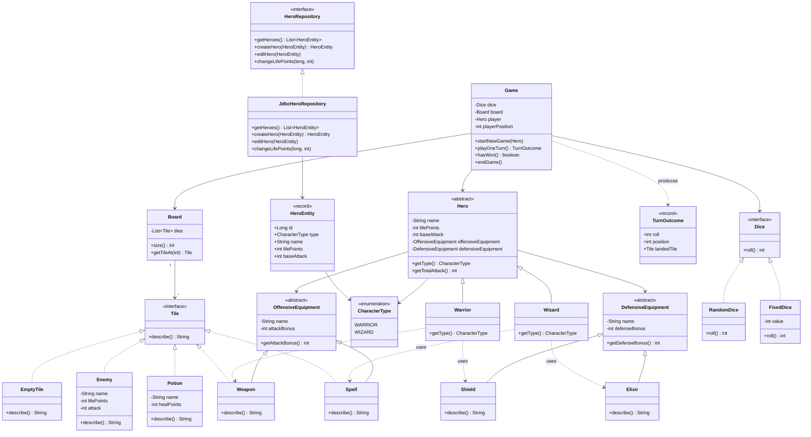

# DungeonCrawler

A turn-based dungeon crawler game built in Java 17. The player picks a hero, rolls a die each turn to advance across a board of tiles, and encounters enemies, potions, or weapons along the way. Heroes are persisted in a database between sessions.

## Features

- Two playable character classes: **Warrior** (balanced) and **Wizard** (high attack, lower health)
- Turn-based movement driven by dice rolls
- Board tiles: enemies, potions, weapons, and empty tiles
- Hero persistence via JDBC (H2 embedded or MariaDB)
- Interactive console menu to create, load, and manage heroes
- Full unit test coverage with JUnit 5

## Requirements

- Java 17+
- Maven 3.8+

## Run

```bash
mvn compile exec:java
```

## Tests

```bash
mvn test
```

## Project Structure

```
src/main/java/com/dnd/
├── model/
│   ├── character/     # Hero (abstract), Warrior, Wizard
│   ├── equipment/     # OffensiveEquipment, DefensiveEquipment and subclasses
│   └── CharacterType  # WARRIOR / WIZARD enum
├── board/             # Tile (interface), Enemy, Potion, EmptyTile, Board
├── game/              # Game, Dice, TurnOutcome, CharacterOutOfBoundsException
├── db/                # HeroRepository, JdbcHeroRepository, HeroEntity, HeroMapper
├── menu/              # Console menu
└── Main.java
```

## UML Class Diagram


```mermaid
classDiagram
    %% ── Character model ──────────────────────────────────────────
    class Hero {
        <<abstract>>
        -String name
        -int lifePoints
        -int baseAttack
        -OffensiveEquipment offensiveEquipment
        -DefensiveEquipment defensiveEquipment
        +getType() CharacterType
        +getTotalAttack() int
    }
    class Warrior {
        +getType() CharacterType
    }
    class Wizard {
        +getType() CharacterType
    }
    class CharacterType {
        <<enumeration>>
        WARRIOR
        WIZARD
    }

    Hero <|-- Warrior
    Hero <|-- Wizard
    Hero --> CharacterType

    %% ── Equipment ────────────────────────────────────────────────
    class OffensiveEquipment {
        <<abstract>>
        -String name
        -int attackBonus
        +getAttackBonus() int
    }
    class DefensiveEquipment {
        <<abstract>>
        -String name
        -int defenseBonus
        +getDefenseBonus() int
    }
    class Weapon  { +describe() String }
    class Spell   { +describe() String }
    class Shield  { +describe() String }
    class Elixir  { +describe() String }

    OffensiveEquipment <|-- Weapon
    OffensiveEquipment <|-- Spell
    DefensiveEquipment <|-- Shield
    DefensiveEquipment <|-- Elixir

    Hero --> OffensiveEquipment
    Hero --> DefensiveEquipment
    Warrior ..> Weapon : uses
    Warrior ..> Shield : uses
    Wizard  ..> Spell  : uses
    Wizard  ..> Elixir : uses

    %% ── Board ────────────────────────────────────────────────────
    class Tile {
        <<interface>>
        +describe() String
    }
    class EmptyTile { +describe() String }
    class Enemy {
        -String name
        -int lifePoints
        -int attack
        +describe() String
    }
    class Potion {
        -String name
        -int healPoints
        +describe() String
    }
    class Board {
        -List~Tile~ tiles
        +size() int
        +getTileAt(int) Tile
    }

    Tile <|.. EmptyTile
    Tile <|.. Enemy
    Tile <|.. Potion
    Tile <|.. Weapon
    Tile <|.. Spell
    Board "1" --> "*" Tile

    %% ── Game engine ──────────────────────────────────────────────
    class Dice {
        <<interface>>
        +roll() int
    }
    class RandomDice { +roll() int }
    class FixedDice  {
        -int value
        +roll() int
    }
    class TurnOutcome {
        <<record>>
        +int roll
        +int position
        +Tile landedTile
    }
    class Game {
        -Dice dice
        -Board board
        -Hero player
        -int playerPosition
        +startNewGame(Hero)
        +playOneTurn() TurnOutcome
        +hasWon() boolean
        +endGame()
    }

    Dice <|.. RandomDice
    Dice <|.. FixedDice
    Game --> Dice
    Game --> Board
    Game --> Hero
    Game ..> TurnOutcome : produces

    %% ── Persistence ──────────────────────────────────────────────
    class HeroRepository {
        <<interface>>
        +getHeroes() List~HeroEntity~
        +createHero(HeroEntity) HeroEntity
        +editHero(HeroEntity)
        +changeLifePoints(long, int)
    }
    class JdbcHeroRepository {
        +getHeroes() List~HeroEntity~
        +createHero(HeroEntity) HeroEntity
        +editHero(HeroEntity)
        +changeLifePoints(long, int)
    }
    class HeroEntity {
        <<record>>
        +Long id
        +CharacterType type
        +String name
        +int lifePoints
        +int baseAttack
    }

    HeroRepository <|.. JdbcHeroRepository
    JdbcHeroRepository --> HeroEntity
    HeroEntity --> CharacterType
```
